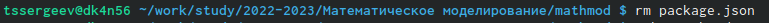

---
## Front matter
lang: ru-RU
title: Защита лабораторной работы
subtitle: Лабораторная работа №1
author:
  - Сергее Т.С.
institute:
  - Российский университет дружбы народов, Москва, Россия
date: 09 февраля 2023

## i18n babel
babel-lang: russian
babel-otherlangs: english

## Formatting pdf
toc: false
toc-title: Содержание
slide_level: 2
aspectratio: 169
section-titles: true
theme: metropolis
header-includes:
 - \metroset{progressbar=frametitle,sectionpage=progressbar,numbering=fraction}
 - '\makeatletter'
 - '\beamer@ignorenonframefalse'
 - '\makeatother'
---

# Информация

## Докладчик

:::::::::::::: {.columns align=center}
::: {.column width="70%"}

  * Сергеев Тимофей Сергеевич
  * Студент 3 курса группы НФИбд-02-20
  * Студенческий билет №1032201669
  * Российский университет дружбы народов
  * [1032201669@pfur.ru](mailto:1032201669@pfur.ru)

:::
::: {.column width="30%"}

:::
::::::::::::::

# Вводная часть

## Актуальность

- Данная работа нацелена на изучение крупнейшего веб-сервиса для хостинга IT-проектов Github
- Заточена так же на освоение навыков рабоnы с ним через консоль
- Не менее важным является задача вспомнить основы работы с Markdown

## Объект и предмет исследования

- Консоль компьютера
- Веб-сервис для хостинга IT-проектов Github
- Язык Markdowm

## Цели и задачи

- Создать репозиторий курса на основе предоставленного шаблона
- Посмотреть доступные цели и курсы
- Настроить каталог курса
- Подготовить отчёт

## Материалы и методы

- Процессор `pandoc` для входного формата Markdown
- Результирующие форматы
	- `pdf`
	- `html`
- Автоматизация процесса создания: `Makefile`
- Репозиторий Github

# Выполнение работы

## Создание и подключение ssh-ключа

{width=70%}

{width=70%}

## 

{width=70%}

{width=70%}

## Создание репозитория

{width=40%}

{width=30%}

git clone --recursive git@github.com:
tssergeev/study_2022-2023_mathmod.git mathmod

## Доступные цели и курсы

**make help** и **make list**

{width=70%}

## Настройка каталога курса

{width=70%}

{width=70%}

## 

{width=40%}

{width=70%}

# Результаты

## Результаты 

В итоге после выполнения данной лабораторной работы мы имеем основу для выполнения последующих лабораторных работ. Также мы познакомились с ещё некоторыми возможностями github'а и вспомнили основы работы с markdown.

## Итоговый слайд

**Вовремя выполненная лабораторная работа - хорошая оценка - довольный студент - счастливое будущее!**

