---
## Front matter
title: "Отчёт по лабораторной работе"
subtitle: "Лабораторная работа №1"
author: "Сергеев Тимофей Сергеевич"

## Generic otions
lang: ru-RU
toc-title: "Содержание"

## Bibliography
bibliography: bib/cite.bib
csl: pandoc/csl/gost-r-7-0-5-2008-numeric.csl

## Pdf output format
toc: true # Table of contents
toc-depth: 2
lof: true # List of figures
lot: true # List of tables
fontsize: 12pt
linestretch: 1.5
papersize: a4
documentclass: scrreprt
## I18n polyglossia
polyglossia-lang:
  name: russian
  options:
	- spelling=modern
	- babelshorthands=true
polyglossia-otherlangs:
  name: english
## I18n babel
babel-lang: russian
babel-otherlangs: english
## Fonts
mainfont: PT Serif
romanfont: PT Serif
sansfont: PT Sans
monofont: PT Mono
mainfontoptions: Ligatures=TeX
romanfontoptions: Ligatures=TeX
sansfontoptions: Ligatures=TeX,Scale=MatchLowercase
monofontoptions: Scale=MatchLowercase,Scale=0.9
## Biblatex
biblatex: true
biblio-style: "gost-numeric"
biblatexoptions:
  - parentracker=true
  - backend=biber
  - hyperref=auto
  - language=auto
  - autolang=other*
  - citestyle=gost-numeric
## Pandoc-crossref LaTeX customization
figureTitle: "Рис."
tableTitle: "Таблица"
listingTitle: "Листинг"
lofTitle: "Список иллюстраций"
lotTitle: "Список таблиц"
lolTitle: "Листинги"
## Misc options
indent: true
header-includes:
  - \usepackage{indentfirst}
  - \usepackage{float} # keep figures where there are in the text
  - \floatplacement{figure}{H} # keep figures where there are in the text
---

# Цель работы

Целью выполнения данной лабораторной работы является подготовка рабочего пространства для выполнения дальнейших лабораторных работ.

# Задание

- Создать репозиторий курса на основе предоставленного шаблона
- Посмотреть доступные цели и курсы
- Настроить каталог курса
- Подготовить отчёт

# Теоретическое введение

**Markdown** — облегчённый язык разметки, созданный с целью обозначения форматирования в простом тексте, с максимальным сохранением его читаемости человеком, и пригодный для машинного преобразования в языки для продвинутых публикаций.
**GitHub** — крупнейший веб-сервис для хостинга IT-проектов и их совместной разработки. 

# Выполнение лабораторной работы

1. Сперва необходимо создать новый ключ SSH и пароль (рис. @fig:001).

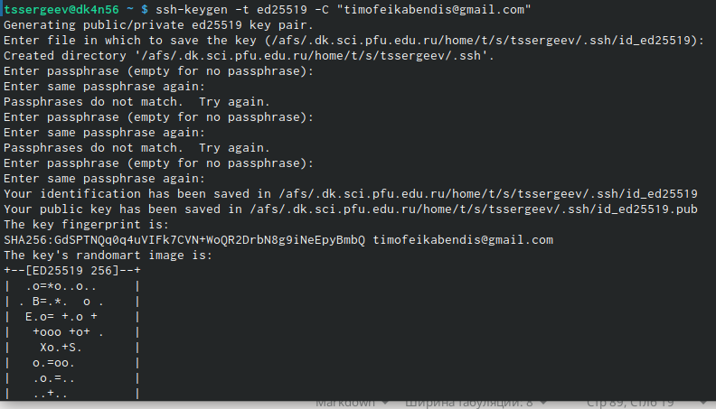{#fig:001 width=70%}

2. Затем добавляем этот ключ в ssh-agent (рис. @fig:002).

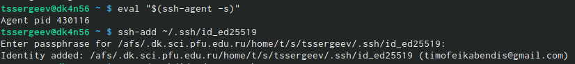{#fig:002 width=70%}

3. Далее добавляем новый ключ SSH в учётную запись (рис. @fig:003 , @fig:004, @fig:005).

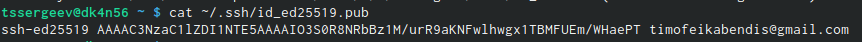{#fig:003 width=70%}

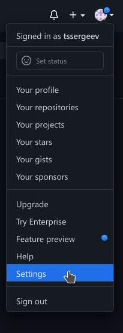{#fig:004 width=70%}

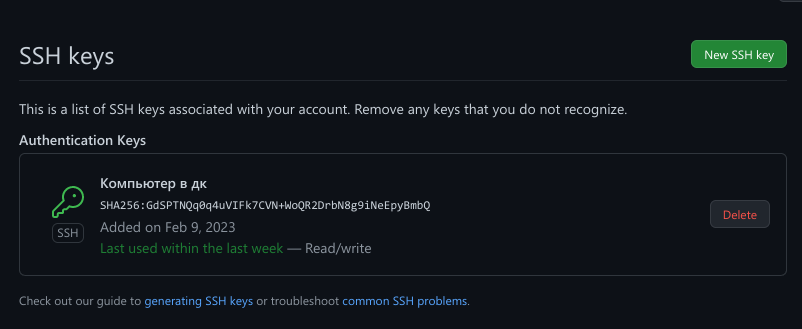{#fig:005 width=70%}

4. Затем создадим репозиторий курса на основе шаблона (рис. @fig:006, @fig:007, @fig:008).

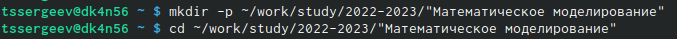{#fig:006 width=70%}

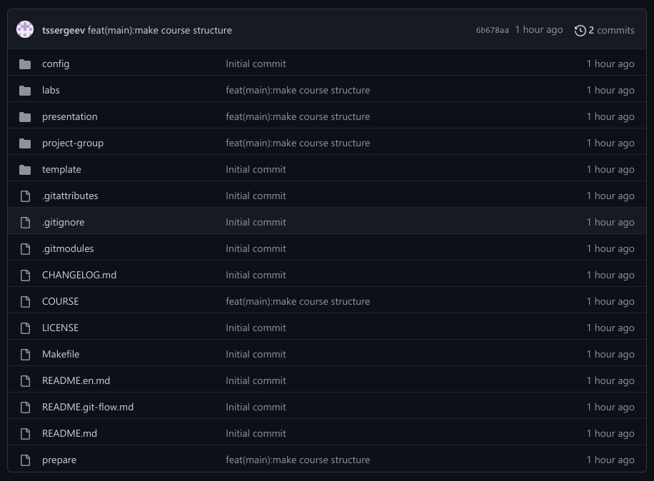{#fig:007 width=70%}

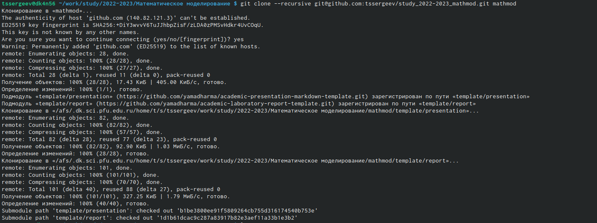{#fig:008 width=70%}

5. Просматриваем доступные цели и список доступных курсов (рис. @fig:009).

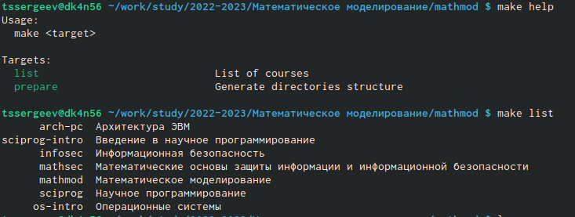{#fig:009 width=70%}

6. Настройка каталога курса: удаление лишних файлов, создание необходимых каталогов и отправка файлов на сервер (рис. @fig:010 , @fig:011, @fig:012, @fig:013).

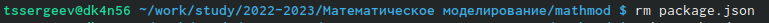{#fig:010 width=70%}

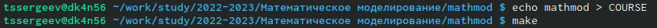{#fig:011 width=70%}

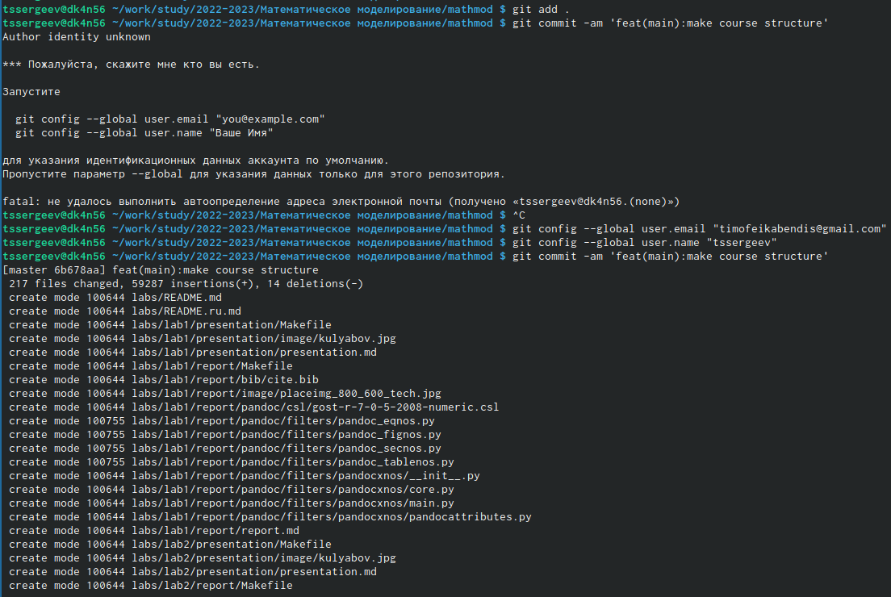{#fig:012 width=70%}

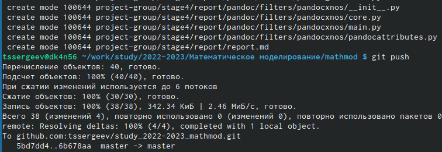{#fig:013 width=70%}

7. Создаём данный отчёт.

# Выводы

В итоге после выполнения данной лабораторной работы мы имеем основу для выполнения последующих лабораторных работ. Также мы познакомились с ещё некоторыми возможностями github'а и вспомнили основы работы с markdown.

# Список литературы{.unnumbered}

1. Информация о Markdown: {#https://ru.wikipedia.org/wiki/Markdown} 
2. Информация о GitHub: {#https://ru.wikipedia.org/wiki/GitHub}
3. Информация о создании ssh-ключа: {#https://docs.github.com/ru/authentication/connecting-to-github-with-ssh/generating-a-new-ssh-key-and-adding-it-to-the-ssh-agent?platform=linux}
4. Информация о добавлении ssh-ключа: {#https://docs.github.com/ru/authentication/connecting-to-github-with-ssh/adding-a-new-ssh-key-to-your-github-account}

