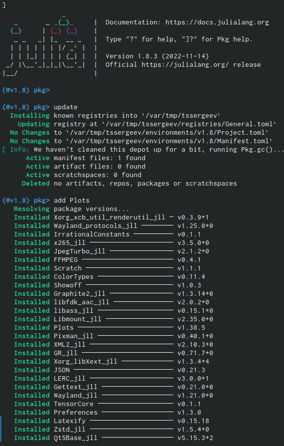
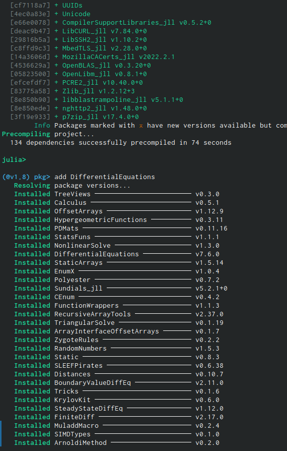
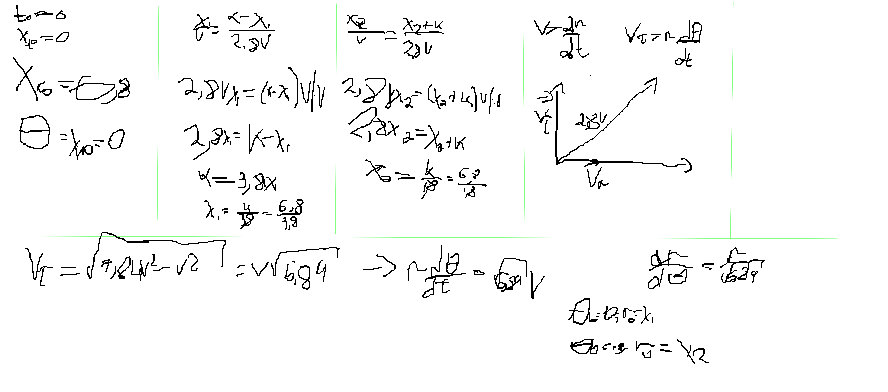
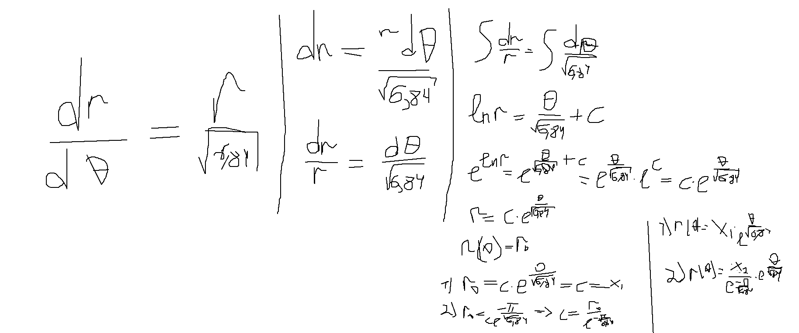
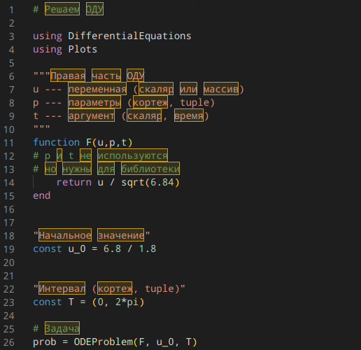
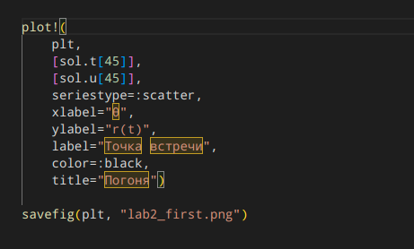
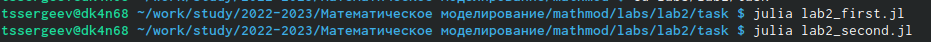
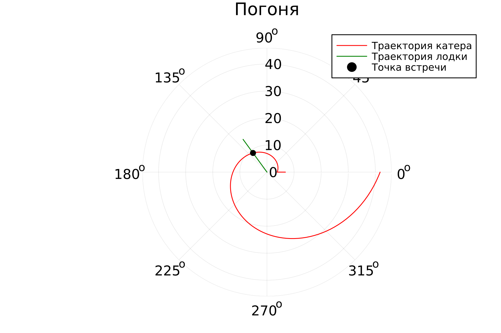
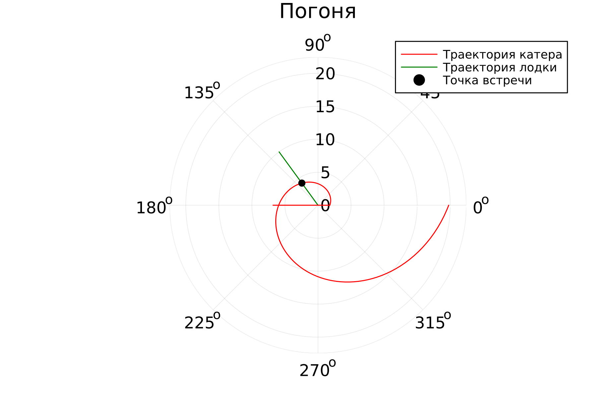

---
## Front matter
lang: ru-RU
title: Защита лабораторной работы
subtitle: Лабораторная работа №2 (вариант 10)
author:
  - Сергее Т.С.
institute:
  - Российский университет дружбы народов, Москва, Россия
date: 09 февраля 2023

## i18n babel
babel-lang: russian
babel-otherlangs: english

## Formatting pdf
toc: false
toc-title: Содержание
slide_level: 2
aspectratio: 169
section-titles: true
theme: metropolis
header-includes:
 - \metroset{progressbar=frametitle,sectionpage=progressbar,numbering=fraction}
 - '\makeatletter'
 - '\beamer@ignorenonframefalse'
 - '\makeatother'
---

# Информация

## Докладчик

:::::::::::::: {.columns align=center}
::: {.column width="70%"}

  * Сергеев Тимофей Сергеевич
  * Студент 3 курса группы НФИбд-02-20
  * Студенческий билет №1032201669
  * Российский университет дружбы народов
  * [1032201669@pfur.ru](mailto:1032201669@pfur.ru)

:::
::: {.column width="30%"}

:::
::::::::::::::

# Вводная часть

## Актуальность

- Данная работа нацелена на изучение языка программирования Julia, созданный для выполнения математических вычислений.

## Объект и предмет исследования

- Консоль компьютера
- Язык программирования Julia

## Цели и задачи

- Построить математическую модель для выбора правильной стратегии при решении задач поиска на примере задачи преследования браконьеров береговой охраной.
- Подготовить инструменты для выполнения лабораторной работы;
- Записать уравнение, описывающее движение катера, с начальными условиями для двух случаев;
- Построить траекторию движения катера и лодки для двух случаев;
- Найти точку пересечения траектории катера и лодки. 

# Выполнение работы

## Подготовка

{width=25%}

##

{width=50%}

## Выполнение расчётов

{width=50%}

##

{width=50%}

## Написание программы на Julia

{width=40%}

##

{width=30%}

##

{width=50%}

## Запуск

{width=50%}

## Результаты выполнения программ

{width=50%}

##

{width=50%}

# Результаты

## Результаты 

Выполнив данную лабораторную работу, мы познакомились с языком программирования Julia и с некоторыми его основами, которые понадобятся нам при выполнении следующих лабораторных работ. В дальнейших работах будем осваивать язык OpenModelica и сравнивать реализации программ на этих языках.

## Итоговый слайд

**Вовремя выполненная лабораторная работа - хорошая оценка - довольный студент - счастливое будущее!**

