---
## Front matter
title: "Отчёт по лабораторной работе"
subtitle: "Лабораторная работа №2 (вариант 10)"
author: "Сергеев Тимофей Сергеевич"

## Generic otions
lang: ru-RU
toc-title: "Содержание"

## Bibliography
bibliography: bib/cite.bib
csl: pandoc/csl/gost-r-7-0-5-2008-numeric.csl

## Pdf output format
toc: true # Table of contents
toc-depth: 2
lof: true # List of figures
lot: true # List of tables
fontsize: 12pt
linestretch: 1.5
papersize: a4
documentclass: scrreprt
## I18n polyglossia
polyglossia-lang:
  name: russian
  options:
	- spelling=modern
	- babelshorthands=true
polyglossia-otherlangs:
  name: english
## I18n babel
babel-lang: russian
babel-otherlangs: english
## Fonts
mainfont: PT Serif
romanfont: PT Serif
sansfont: PT Sans
monofont: PT Mono
mainfontoptions: Ligatures=TeX
romanfontoptions: Ligatures=TeX
sansfontoptions: Ligatures=TeX,Scale=MatchLowercase
monofontoptions: Scale=MatchLowercase,Scale=0.9
## Biblatex
biblatex: true
biblio-style: "gost-numeric"
biblatexoptions:
  - parentracker=true
  - backend=biber
  - hyperref=auto
  - language=auto
  - autolang=other*
  - citestyle=gost-numeric
## Pandoc-crossref LaTeX customization
figureTitle: "Рис."
tableTitle: "Таблица"
listingTitle: "Листинг"
lofTitle: "Список иллюстраций"
lotTitle: "Список таблиц"
lolTitle: "Листинги"
## Misc options
indent: true
header-includes:
  - \usepackage{indentfirst}
  - \usepackage{float} # keep figures where there are in the text
  - \floatplacement{figure}{H} # keep figures where there are in the text
---

# Цель работы

Построить математическую модель для выбора правильной стратегии при решении задач поиска на примере задачи преследования браконьеров береговой охраной.

# Задание

- Подготовить инструменты для выполнения лабораторной работы;
- Записать уравнение, описывающее движение катера, с начальными условиями для двух случаев;
- Построить траекторию движения катера и лодки для двух случаев;
- Найти точку пересечения траектории катера и лодки. 

# Теоретическое введение

**Julia** -- высокоуровневый высокопроизводительный свободный язык программирования с динамической типизацией, созданный для математических вычислений. Эффективен также и для написания программ общего назначения. Синтаксис языка схож с синтаксисом других математических языков (например, MATLAB и Octave), однако имеет некоторые существенные отличия. Julia написан на Си, C++ и Scheme. Имеет встроенную поддержку многопоточности и распределённых вычислений, реализованные в том числе в стандартных конструкциях. [@Key-1]

**OpenModelica** -- свободное открытое программное обеспечение для моделирования, симуляции, оптимизации и анализа сложных динамических систем. Основано на языке Modelica. Активно развивается Open Source Modelica Consortium, некоммерческой неправительственной организацией. Open Source Modelica Consortium является совместным проектом RISE SICS East AB и Линчёпингского университета. [@Key-2]

# Выполнение лабораторной работы

1. Настраиваем рабочую среду для выполнения лабораторной работы, а именно обновляем Julia, добавляем библиотеки Plots и DifferentialEquations (рис. @fig:001, @fig:002).

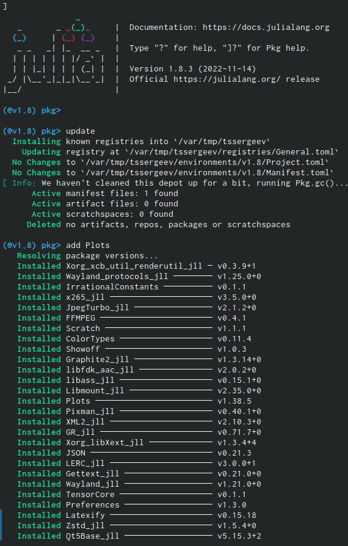{#fig:001 width=70%}

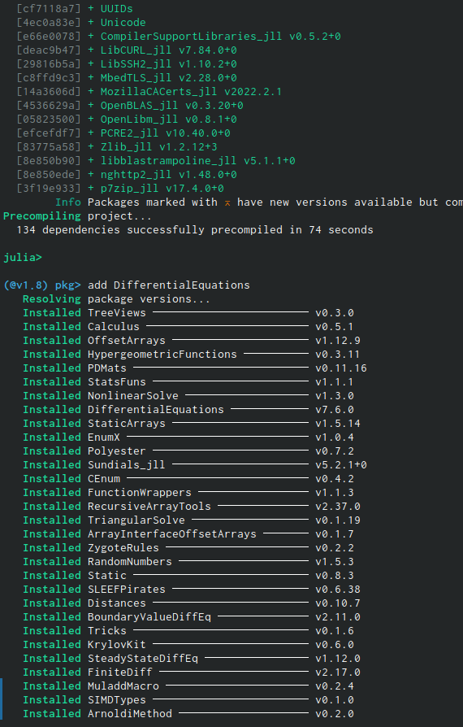{#fig:002 width=70%}

2. Далее необходимо произвести математические расчёты в соответствии с материалами к лабораторной работе, но использовав свои данные, после чего дорешать получившееся уравнение. После выполнения расчётов ниже, мы получим траекторию движения катера в полярных координатах (рис. @fig:003, @fig:004).

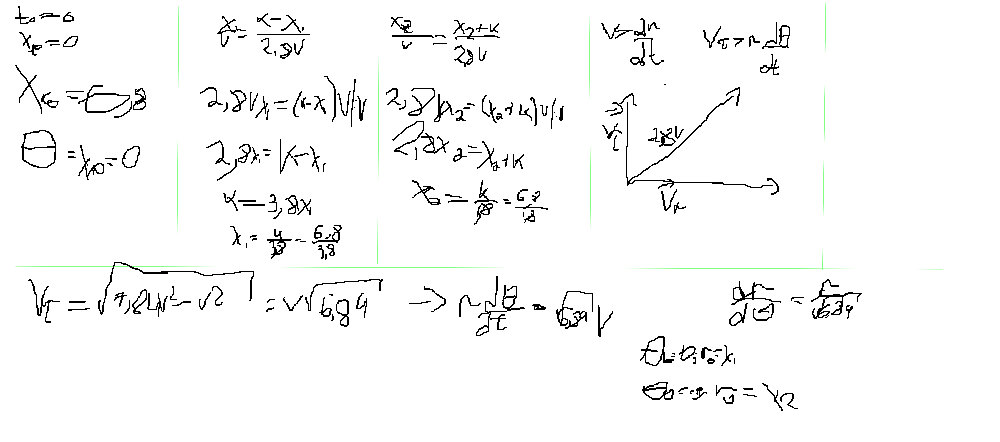{#fig:003 width=70%}

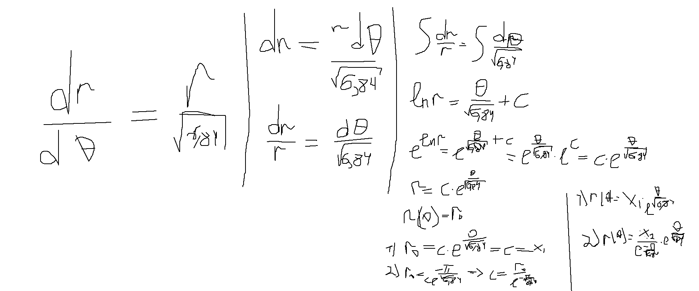{#fig:004 width=70%}

3. Теперь приступим к написанию программы на Julia (рис. @fig:005, @fig:006, @fig:007).

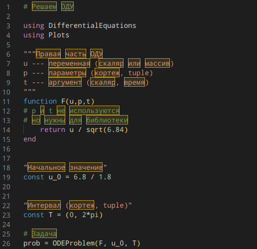{#fig:005 width=70%}

{#fig:006 width=70%}

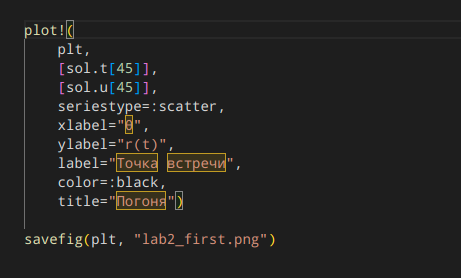{#fig:007 width=70%}

4. В зависимости от начального положения катера относительно полюса появляется второй случай (рис. @fig:008, @fig:009, @fig:010).

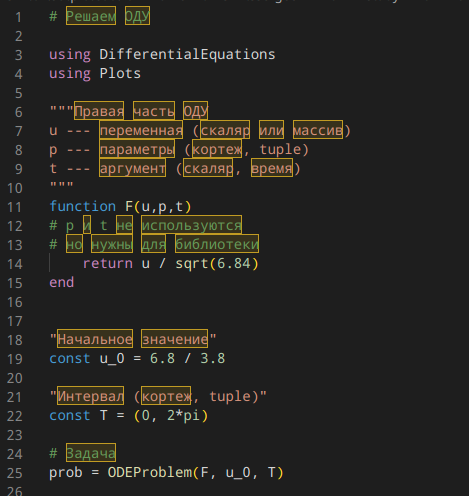{#fig:008 width=70%}

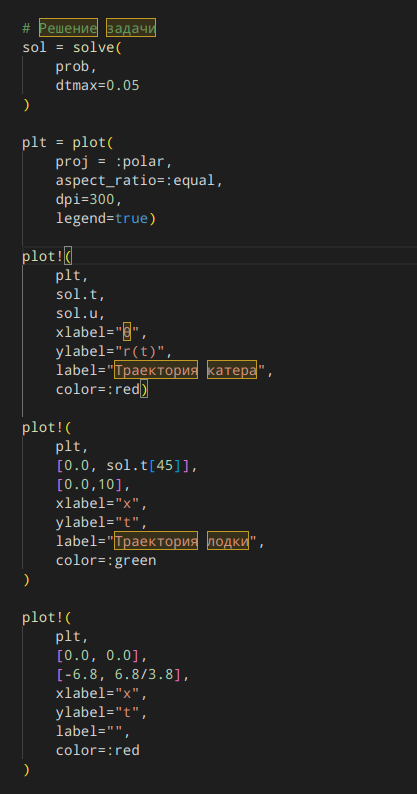{#fig:009 width=70%}

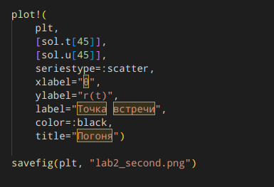{#fig:010 width=70%}

5. Последним действием необходимо запустить и выполнить программы следующим образом (рис. @fig:011).

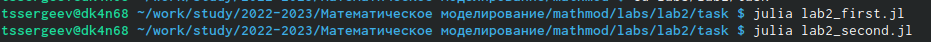{#fig:011 width=70%} 

6. Получаем следующий результат (рис. @fig:012, @fig:013).

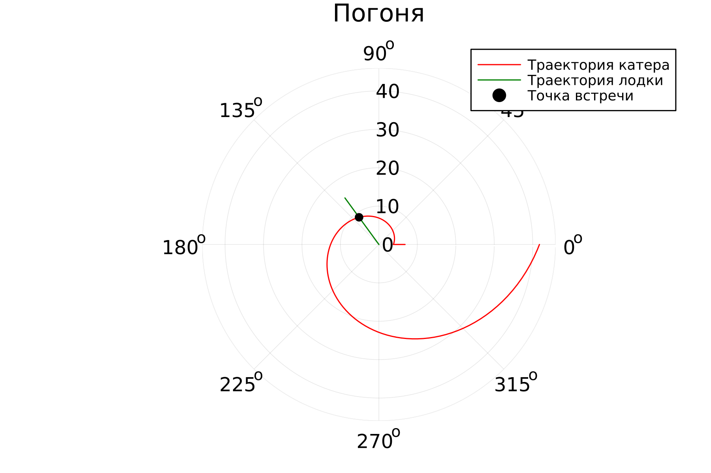{#fig:012 width=70%}

{#fig:013 width=70%}

7. Результаты соответствуют поставленной задаче: сперва береговая охрана доходит до точки начала движения в зависимости от положения относительно полюса, после чего начинает движение и доходит до точки пересечения с браконьерами, которая так же обозначена на рисунке.

8. С помощью стандартных решений OpenModelica не получится представить решение данной программы, поэтому приступим к решению лабораторных работ на этом языке при выполнении следующей лабораторной работы.

# Выводы

Выполнив данную лабораторную работу, мы познакомились с языком программирования Julia и с некоторыми его основами, которые понадобятся нам при выполнении следующих лабораторных работ. В дальнейших работах будем осваивать язык OpenModelica и сравнивать реализации программ на этих языках.

# Список литературы{.unnumbered}

::: {#refs}
:::
