---
## Front matter
title: "Отчёт по лабораторной работе"
subtitle: "Лабораторная работа №3 (вариант 10)"
author: "Сергеев Тимофей Сергеевич"

## Generic otions
lang: ru-RU
toc-title: "Содержание"

## Bibliography
bibliography: bib/cite.bib
csl: pandoc/csl/gost-r-7-0-5-2008-numeric.csl

## Pdf output format
toc: true # Table of contents
toc-depth: 2
lof: true # List of figures
lot: true # List of tables
fontsize: 12pt
linestretch: 1.5
papersize: a4
documentclass: scrreprt
## I18n polyglossia
polyglossia-lang:
  name: russian
  options:
	- spelling=modern
	- babelshorthands=true
polyglossia-otherlangs:
  name: english
## I18n babel
babel-lang: russian
babel-otherlangs: english
## Fonts
mainfont: PT Serif
romanfont: PT Serif
sansfont: PT Sans
monofont: PT Mono
mainfontoptions: Ligatures=TeX
romanfontoptions: Ligatures=TeX
sansfontoptions: Ligatures=TeX,Scale=MatchLowercase
monofontoptions: Scale=MatchLowercase,Scale=0.9
## Biblatex
biblatex: true
biblio-style: "gost-numeric"
biblatexoptions:
  - parentracker=true
  - backend=biber
  - hyperref=auto
  - language=auto
  - autolang=other*
  - citestyle=gost-numeric
## Pandoc-crossref LaTeX customization
figureTitle: "Рис."
tableTitle: "Таблица"
listingTitle: "Листинг"
lofTitle: "Список иллюстраций"
lotTitle: "Список таблиц"
lolTitle: "Листинги"
## Misc options
indent: true
header-includes:
  - \usepackage{indentfirst}
  - \usepackage{float} # keep figures where there are in the text
  - \floatplacement{figure}{H} # keep figures where there are in the text
---

# Цель работы

Построить математическую модель боевых действий двух стран - Х и У. Рассмотреть два случая: с участием партизанских отрядов и без.

# Задание

- Написать код для первого и второго случая на языке Julia.
- Написать код для первого и второго случая на языке Modelica.
- Составить отчёт на языке Markdown и сконвертировать его в docx и pdf.
- Подгjтовить презентацию на языке Markdown и защитить её.

# Теоретическое введение

**Julia** -- высокоуровневый высокопроизводительный свободный язык программирования с динамической типизацией, созданный для математических вычислений. Эффективен также и для написания программ общего назначения. Синтаксис языка схож с синтаксисом других математических языков (например, MATLAB и Octave), однако имеет некоторые существенные отличия. Julia написан на Си, C++ и Scheme. Имеет встроенную поддержку многопоточности и распределённых вычислений, реализованные в том числе в стандартных конструкциях. [@Key-1]

**OpenModelica** -- свободное открытое программное обеспечение для моделирования, симуляции, оптимизации и анализа сложных динамических систем. Основано на языке Modelica. Активно развивается Open Source Modelica Consortium, некоммерческой неправительственной организацией. Open Source Modelica Consortium является совместным проектом RISE SICS East AB и Линчёпингского университета. [@Key-2]

**Моделирование боевых действий** является важнейшей научной и практической задачей, направленной на предоставление командованию количественных оснований для принятия решений. [@Key-3]

# Выполнение лабораторной работы

1.  Рассмотрим код на языке Modelica с для первого случая. Объявим переменные и коэффициенты типа Real (потому что это тип с плавающим знаком, наиболее подходящий для решения дифференциальных уравнений). Затем инициализурем х и у, подставим значения армий, данные нам в условии. После этого пропишем решение наших дифференциальных уравнений (рис. @fig:01).

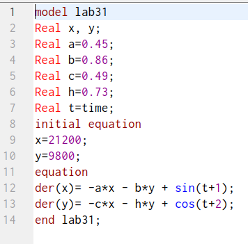{#fig:01 width=70%}

2. Результат симуляции для первого случая (рис. @fig:02).

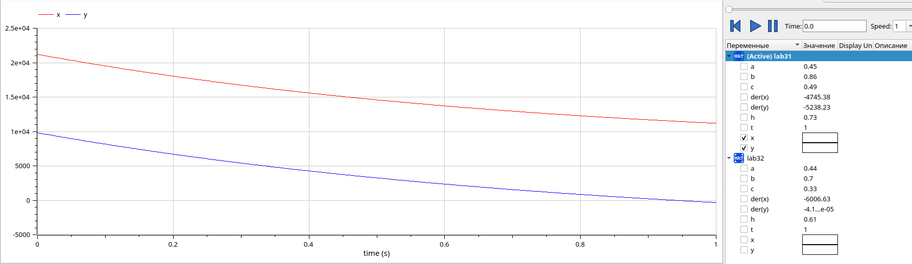{#fig:02 width=70%}

3. Аналогично пишется код и для второго случая, меняются коэффициенты и второе дифференциальное уравнение (рис. @fig:03).

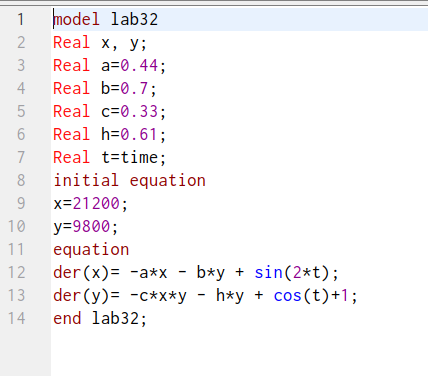{#fig:03 width=70%}

4. Результат симуляции для первого случая (рис. @fig:04).

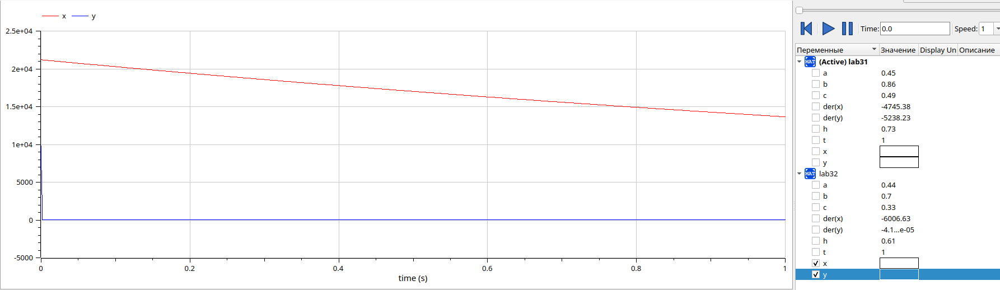{#fig:04 width=70%}

5. Теперь опишем первый случай на языке Julia.(рис. @fig:05, @fig:06, @fig:07).

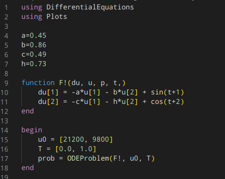{#fig:05 width=70%}

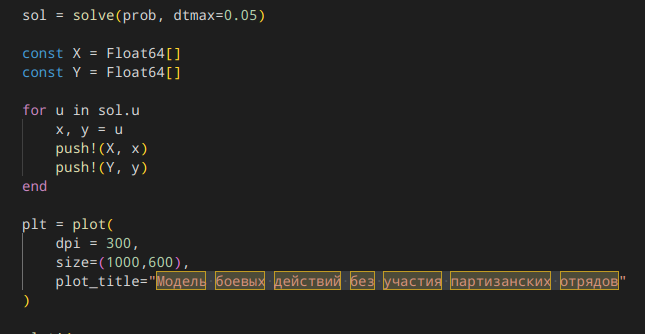{#fig:06 width=70%}

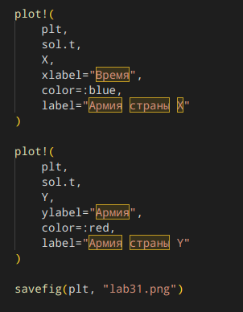{#fig:07 width=70%}

6. Получим следующий результат (рис. @fig:08).

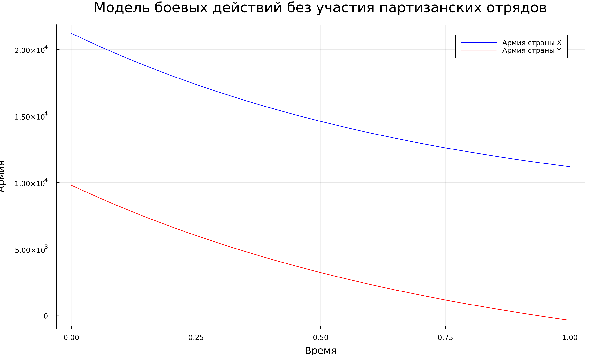{#fig:08 width=70%}

7. Опишем тем же образом второй случай на языке Julia.(рис. @fig:09, @fig:10, @fig:11).

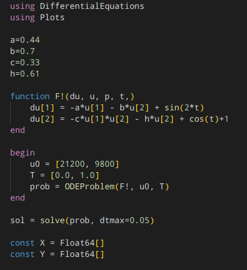{#fig:09 width=70%}

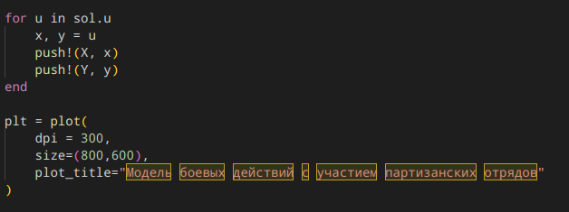{#fig:10 width=70%}

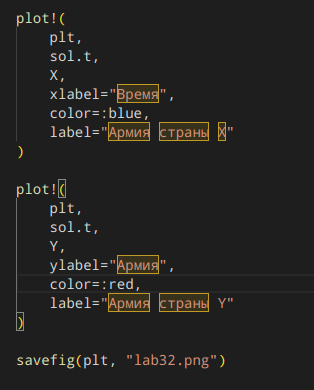{#fig:11 width=70%}

8. Получим следующий результат (рис. @fig:12).

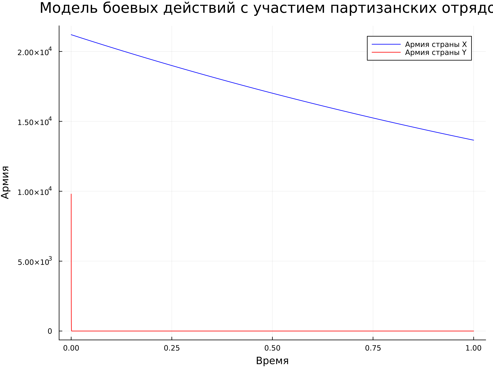{#fig:12 width=70%}

# Выводы

Выполнив данную лабораторную работу, мы продолжили знакомство с языком программирования Julia, начали изучение языка Modelica. Сравнивая реализацию одной программы на этих двух языках, можно заметить, что реализация на языке Modelica заметно проще и более точно показывает результат, поскольку можно отследить значения переменных с максимальной точностью на любом отрезке графика. 

# Список литературы{.unnumbered}

::: {#refs}
:::
