---
## Front matter
title: "Отчёт по лабораторной работе"
subtitle: "Лабораторная работа №4 (вариант 10)"
author: "Сергеев Тимофей Сергеевич"

## Generic otions
lang: ru-RU
toc-title: "Содержание"

## Bibliography
bibliography: bib/cite.bib
csl: pandoc/csl/gost-r-7-0-5-2008-numeric.csl

## Pdf output format
toc: true # Table of contents
toc-depth: 2
lof: true # List of figures
lot: true # List of tables
fontsize: 12pt
linestretch: 1.5
papersize: a4
documentclass: scrreprt
## I18n polyglossia
polyglossia-lang:
  name: russian
  options:
	- spelling=modern
	- babelshorthands=true
polyglossia-otherlangs:
  name: english
## I18n babel
babel-lang: russian
babel-otherlangs: english
## Fonts
mainfont: PT Serif
romanfont: PT Serif
sansfont: PT Sans
monofont: PT Mono
mainfontoptions: Ligatures=TeX
romanfontoptions: Ligatures=TeX
sansfontoptions: Ligatures=TeX,Scale=MatchLowercase
monofontoptions: Scale=MatchLowercase,Scale=0.9
## Biblatex
biblatex: true
biblio-style: "gost-numeric"
biblatexoptions:
  - parentracker=true
  - backend=biber
  - hyperref=auto
  - language=auto
  - autolang=other*
  - citestyle=gost-numeric
## Pandoc-crossref LaTeX customization
figureTitle: "Рис."
tableTitle: "Таблица"
listingTitle: "Листинг"
lofTitle: "Список иллюстраций"
lotTitle: "Список таблиц"
lolTitle: "Листинги"
## Misc options
indent: true
header-includes:
  - \usepackage{indentfirst}
  - \usepackage{float} # keep figures where there are in the text
  - \floatplacement{figure}{H} # keep figures where there are in the text
---

# Цель работы

Построить фазовый портрет гармонического осциллятора и решение уравнения гармонического осциллятора.

# Задание

- Написать код на языке Julia для случаев: 
	- без затуханий и без действий внешней силы;
	- c затуханием и без действий внешней силы;
	- c затуханием и под действием внешней силы;
- Написать код на языке Modelica для случаев:
	- без затуханий и без действий внешней силы;
	- c затуханием и без действий внешней силы;
	- c затуханием и под действием внешней силы;
- Составить отчёт на языке Markdown и сконвертировать его в docx и pdf.
- Подготовить презентацию на языке Markdown и защитить её.

# Теоретическое введение

**Julia** -- высокоуровневый высокопроизводительный свободный язык программирования с динамической типизацией, созданный для математических вычислений. Эффективен также и для написания программ общего назначения. Синтаксис языка схож с синтаксисом других математических языков (например, MATLAB и Octave), однако имеет некоторые существенные отличия. Julia написан на Си, C++ и Scheme. Имеет встроенную поддержку многопоточности и распределённых вычислений, реализованные в том числе в стандартных конструкциях. [@Key-1]

**OpenModelica** -- свободное открытое программное обеспечение для моделирования, симуляции, оптимизации и анализа сложных динамических систем. Основано на языке Modelica. Активно развивается Open Source Modelica Consortium, некоммерческой неправительственной организацией. Open Source Modelica Consortium является совместным проектом RISE SICS East AB и Линчёпингского университета. [@Key-2]

**Гармоническим осциллятором** называется система, способная совершать гармонические колебания. В физике модель гармонического осциллятора играет важную роль, особенно при исследовании малых колебаний систем около положения устойчивого равновесия. Примером таких колебаний в квантовой механике являются колебания атомов в твердых телах, молекулах и т.д.[@Key-3] 

# Выполнение лабораторной работы

1.  Рассмотрим код на языке Modelica для первого случая. Объявим переменные типа Real (потому что это тип с плавающим знаком, наиболее подходящий для решения дифференциальных уравнений). Затем инициализурем х и у, подставив данные из условия. После этого пропишем решение наших дифференциальных уравнений (рис. @fig:01).

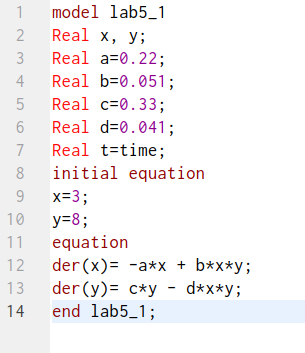{#fig:01 width=70%}

2. Затем установим настройки симуляции (начальное (0) и конечное (30) время и шаг (0.05)) и запустим симуляцию. Получим следующий результат  (рис. @fig:02).

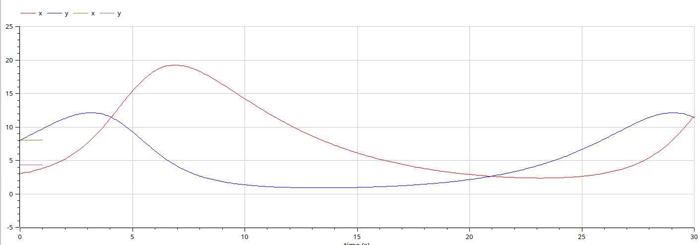{#fig:02 width=70%}

3. Затем необходимо вывести фазовый портрет. В Open Modelica для этого необходимо октрыть новое окно параметрического вывода график, нажать Shift и, удерживая его, поставить галочку у х, после чего поставить галочку у у. В результате на экране появится фазовый портрет (рис. @fig:03).

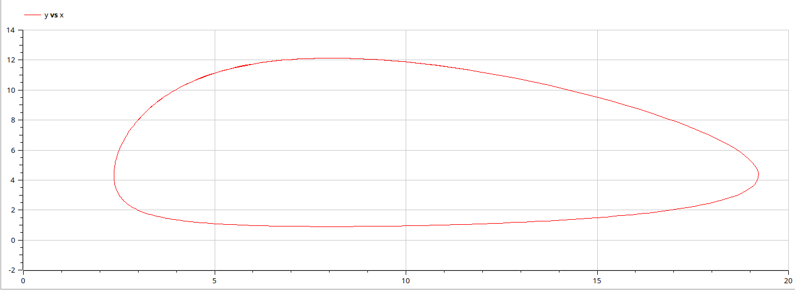{#fig:03 width=70%}

4. Аналогичным образом представим код для второго случая (рис. @fig:04).

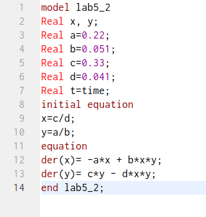{#fig:04 width=70%}

5. Затем установим настройки симуляции (начальное (0) и конечное (30) время и шаг (0.05)) и запустим симуляцию. Получим следующий результат  (рис. @fig:05).

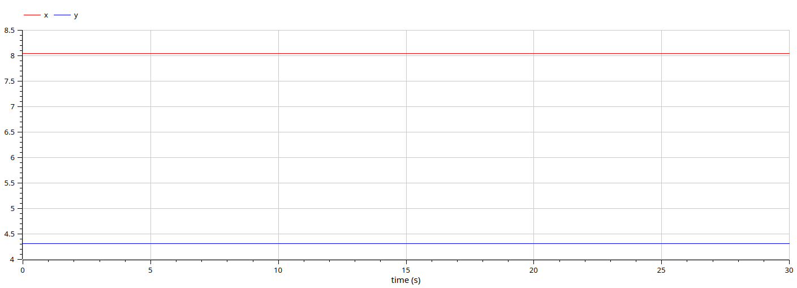{#fig:05 width=70%}

6. Затем выведем фазовый портрет (рис. @fig:06).

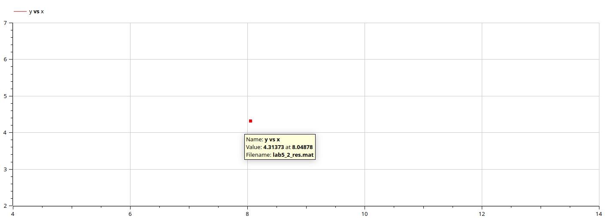{#fig:06 width=70%}

7. Аналогичным образом представим код для третьего случая (в отличие от первых двух случаев,  добавляется тригонометрическая функция косинуса) (рис. @fig:07).

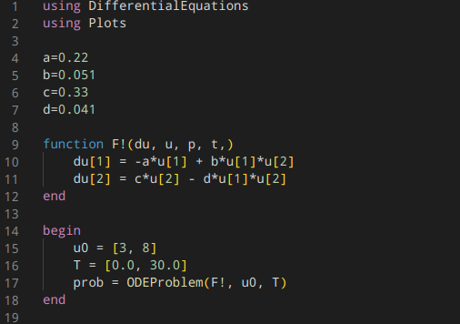{#fig:07 width=70%}

8. Затем установим настройки симуляции (начальное (0) и конечное (30) время и шаг (0.05)) и запустим симуляцию. Получим следующий результат  (рис. @fig:08).

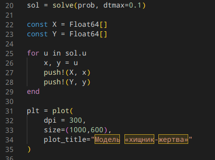{#fig:08 width=70%}

9. Затем выведем фазовый портрет (рис. @fig:09).

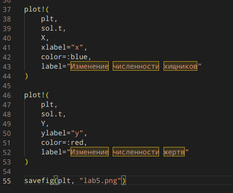{#fig:09 width=70%}

10. Теперь опишем эти случаи на языке Julia. Сперва опишем первый случай (рис. @fig:10, @fig:11, @fig:12).

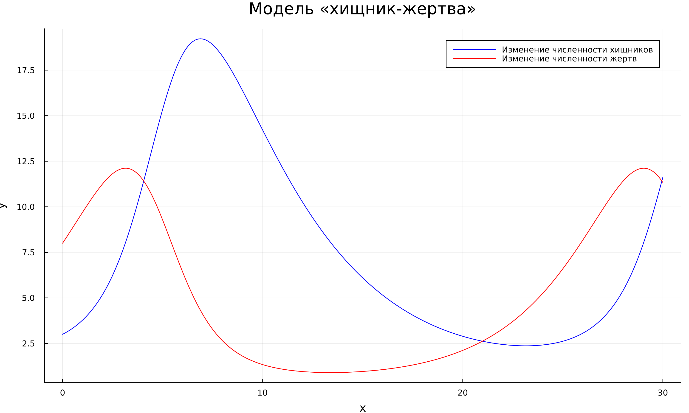{#fig:10 width=70%}

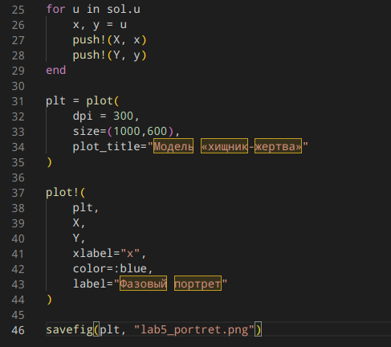{#fig:11 width=70%}

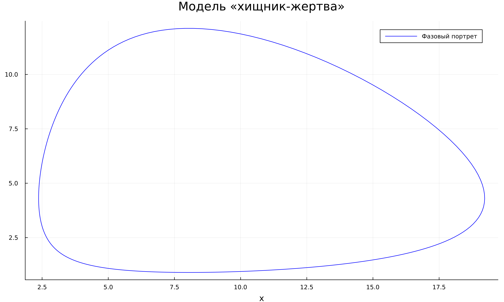{#fig:12 width=70%}

11. Получим следующий результат (рис. @fig:13).

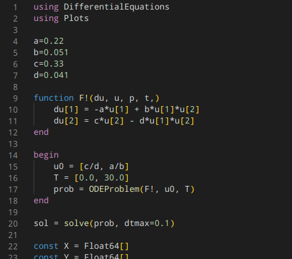{#fig:13 width=70%}

12. Код для вывода на экран фазового портрета отличается лишь в том, что мы хотим вывести на экран (рис. @fig:14).

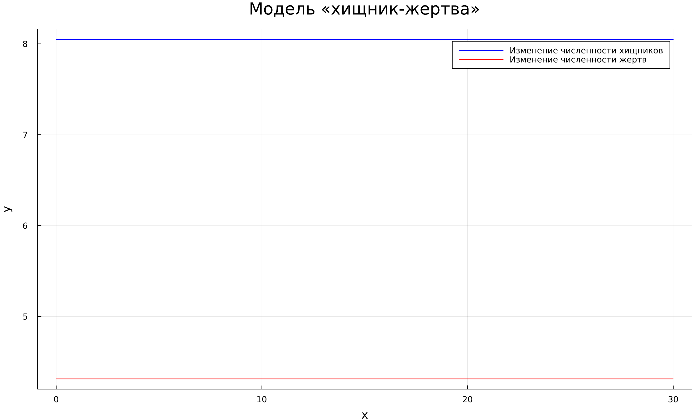{#fig:14 width=70%}

13. Получим следующий результат (рис. @fig:15).

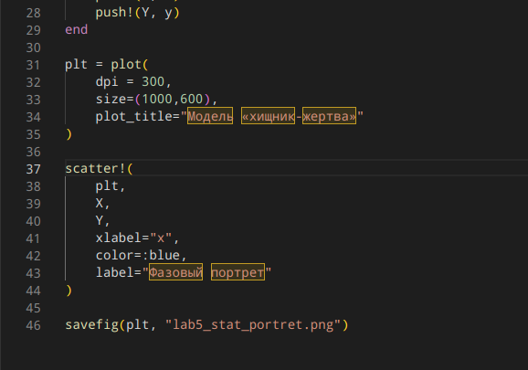{#fig:15 width=70%}

14. Теперь опишем второй случай (рис. @fig:16, @fig:17, @fig:18).

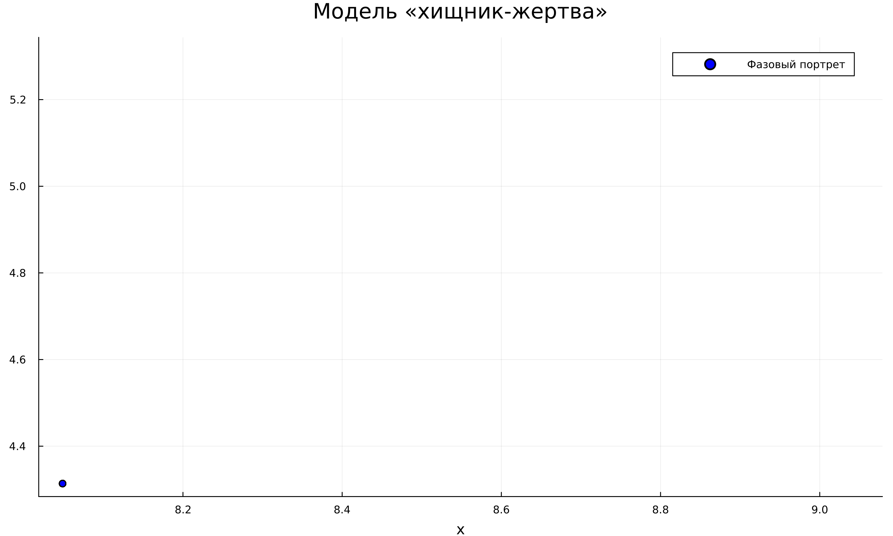{#fig:16 width=70%}

{#fig:17 width=70%}

{#fig:18 width=70%}

15. Получим следующий результат (рис. @fig:19).

{#fig:19 width=70%}

16. Код для вывода на экран фазового портрета отличается лишь в том, что мы хотим вывести на экран (рис. @fig:20).

{#fig:20 width=70%}

17. Получим следующий результат (рис. @fig:21).

{#fig:21 width=70%}

14. Теперь опишем третий случай (рис. @fig:22, @fig:23, @fig:24).

{#fig:22 width=70%}

{#fig:23 width=70%}

{#fig:24 width=70%}

15. Получим следующий результат (рис. @fig:25).

{#fig:25 width=70%}

16. Код для вывода на экран фазового портрета отличается лишь в том, что мы хотим вывести на экран (рис. @fig:26).

{#fig:26 width=70%}

17. Получим следующий результат (рис. @fig:27).

{#fig:27 width=70%}

# Выводы

Выполнив данную лабораторную работу, мы продолжили знакомство с языками программирования Julia и Modelica. Сравнивая реализацию одной программы на этих двух языках, можно заметить, что реализация на языке Modelica заметно проще и более точно показывает результат, поскольку можно отследить значения переменных с максимальной точностью на любом отрезке графика. 

# Список литературы{.unnumbered}

::: {#refs}
:::
