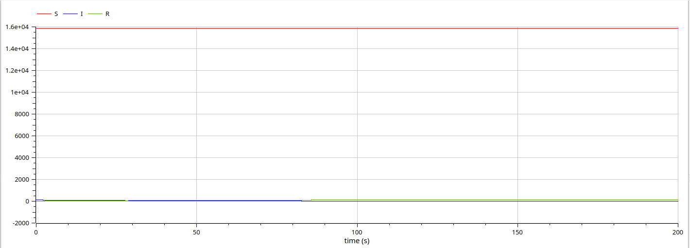
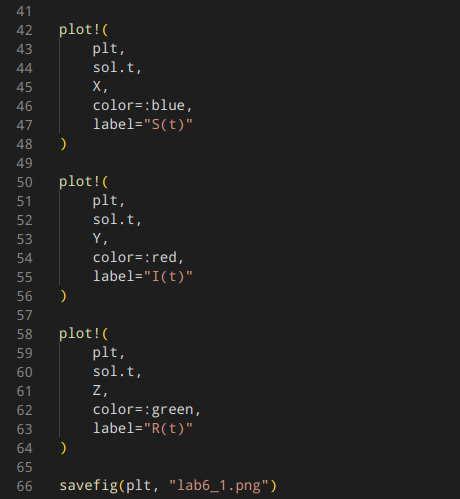
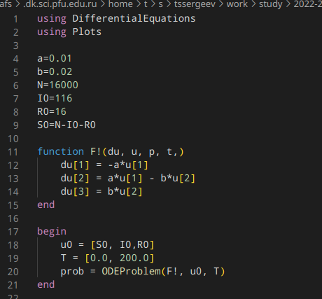

---
## Front matter
lang: ru-RU
title: Защита лабораторной работы
subtitle: Лабораторная работа №6 (вариант 10)
author:
  - Сергее Т.С.
institute:
  - Российский университет дружбы народов, Москва, Россия
date: 09 февраля 2023

## i18n babel
babel-lang: russian
babel-otherlangs: english

## Formatting pdf
toc: false
toc-title: Содержание
slide_level: 2
aspectratio: 169
section-titles: true
theme: metropolis
header-includes:
 - \metroset{progressbar=frametitle,sectionpage=progressbar,numbering=fraction}
 - '\makeatletter'
 - '\beamer@ignorenonframefalse'
 - '\makeatother'
---

# Информация

## Докладчик

:::::::::::::: {.columns align=center}
::: {.column width="70%"}

  * Сергеев Тимофей Сергеевич
  * Студент 3 курса группы НФИбд-02-20
  * Студенческий билет №1032201669
  * Российский университет дружбы народов
  * [1032201669@pfur.ru](mailto:1032201669@pfur.ru)

:::
::: {.column width="30%"}

:::
::::::::::::::

# Вводная часть

## Актуальность

- Данная работа нацелена на изучение языков программирования Julia и Modelica, созданных для выполнения математических вычислений и моделирования.

## Объект и предмет исследования

- Консоль компьютера
- Язык программирования Julia
- Язык программирования Modelica

## Цели и задачи

- Построить графики изменения числа особей в каждой из трех групп во время эпидемии: все проживающие на острове, заболевшие люди, здоровые люди  с иммунитетом. 
- Рассмотреть, как будет протекать эпидемия в случаях, когда число заоблевших не превышает критическое значение и когда превышает.
- Составить отчёт на языке Markdown и сконвертировать его в docx и pdf.
- Подготовить презентацию на языке Markdown и защитить её.

# Выполнение работы

## Modelica

{#fig:01 width=30%}

##

{#fig:02 width=50%}

##

{#fig:03 width=50%}

##

{#fig:04 width=50%}

## Julia 

{#fig:05 width=50%}

##

{#fig:06 width=50%}

##

{#fig:07 width=50%}

##

{#fig:08 width=50%}

##

{#fig:09 width=50%}

##

{#fig:10 width=50%}

# Результаты

## Результаты 

Выполнив данную лабораторную работу, мы продолжили знакомство с языками программирования Julia и Modelica. Сравнивая реализацию одной программы на этих двух языках, можно заметить, что реализация на языке Modelica заметно проще и более точно показывает результат, поскольку можно отследить значения переменных с максимальной точностью на любом отрезке времени. 

## Итоговый слайд

**Вовремя выполненная лабораторная работа - хорошая оценка - довольный студент - счастливое будущее!**

