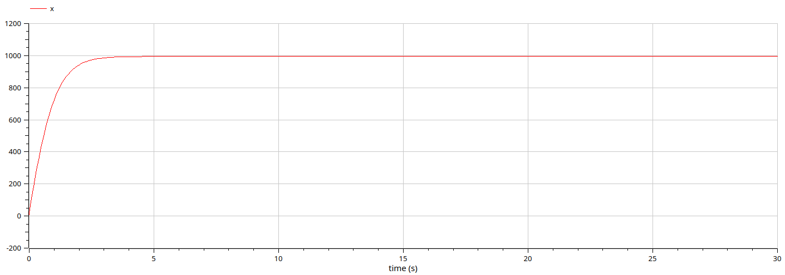

---
## Front matter
title: "Отчёт по лабораторной работе"
subtitle: "Лабораторная работа №7 (вариант 10)"
author: "Сергеев Тимофей Сергеевич"

## Generic otions
lang: ru-RU
toc-title: "Содержание"

## Bibliography
bibliography: bib/cite.bib
csl: pandoc/csl/gost-r-7-0-5-2008-numeric.csl

## Pdf output format
toc: true # Table of contents
toc-depth: 2
lof: true # List of figures
lot: true # List of tables
fontsize: 12pt
linestretch: 1.5
papersize: a4
documentclass: scrreprt
## I18n polyglossia
polyglossia-lang:
  name: russian
  options:
	- spelling=modern
	- babelshorthands=true
polyglossia-otherlangs:
  name: english
## I18n babel
babel-lang: russian
babel-otherlangs: english
## Fonts
mainfont: PT Serif
romanfont: PT Serif
sansfont: PT Sans
monofont: PT Mono
mainfontoptions: Ligatures=TeX
romanfontoptions: Ligatures=TeX
sansfontoptions: Ligatures=TeX,Scale=MatchLowercase
monofontoptions: Scale=MatchLowercase,Scale=0.9
## Biblatex
biblatex: true
biblio-style: "gost-numeric"
biblatexoptions:
  - parentracker=true
  - backend=biber
  - hyperref=auto
  - language=auto
  - autolang=other*
  - citestyle=gost-numeric
## Pandoc-crossref LaTeX customization
figureTitle: "Рис."
tableTitle: "Таблица"
listingTitle: "Листинг"
lofTitle: "Список иллюстраций"
lotTitle: "Список таблиц"
lolTitle: "Листинги"
## Misc options
indent: true
header-includes:
  - \usepackage{indentfirst}
  - \usepackage{float} # keep figures where there are in the text
  - \floatplacement{figure}{H} # keep figures where there are in the text
---

# Цель работы

Построить графики распространения рекламы. Построить решение, если учитывать вклад только платной рекламы. Построить решение, если предположить, что информация о товаре распространятся только путем «сарафанного радио».

# Задание

- Написать код на языке Julia.
- Написать код на языке Modelica для случаев.
- Составить отчёт на языке Markdown и сконвертировать его в docx и pdf.
- Подготовить презентацию на языке Markdown и защитить её.

# Теоретическое введение

**Julia** -- высокоуровневый высокопроизводительный свободный язык программирования с динамической типизацией, созданный для математических вычислений. Эффективен также и для написания программ общего назначения. Синтаксис языка схож с синтаксисом других математических языков (например, MATLAB и Octave), однако имеет некоторые существенные отличия. Julia написан на Си, C++ и Scheme. Имеет встроенную поддержку многопоточности и распределённых вычислений, реализованные в том числе в стандартных конструкциях. [@Key-1]

**OpenModelica** -- свободное открытое программное обеспечение для моделирования, симуляции, оптимизации и анализа сложных динамических систем. Основано на языке Modelica. Активно развивается Open Source Modelica Consortium, некоммерческой неправительственной организацией. Open Source Modelica Consortium является совместным проектом RISE SICS East AB и Линчёпингского университета. [@Key-2]

**Эффективность рекламы** -— это то, в какой степени достигнуты поставленные перед рекламой цели при минимальных затратах.  [@Key-3]	

# Выполнение лабораторной работы

1.  Рассмотрим код на языке Modelica. Объявим переменные и коэффициенты типа Real (потому что это тип с плавающим знаком, наиболее подходящий для решения дифференциальных уравнений). Затем введём начальные значения для переменных, означающих объём аудитории (N), число знающих людей (х0), подставив данные из условия. После этого пропишем решение нашего дифференциального уравнений (рис. @fig:01).

{#fig:01 width=70%}

2. Затем установим настройки симуляции (начальное (0) и конечное (30) время и шаг (0.1)) и запустим симуляцию. Получим следующий результат  (рис. @fig:02).

{#fig:02 width=70%}

3. Аналогичным образом запишем реализацию второго случая (рис. @fig:03).

{#fig:03 width=70%}

4. Затем установим настройки симуляции (начальное (0) и конечное (0.5) время и шаг (0.001)) и запустим симуляцию. Получим следующий результат  (рис. @fig:04).

{#fig:04 width=70%}

5. Аналогичным образом запишем реализацию третьего случая (рис. @fig:05).

{#fig:05 width=70%}

6. Затем установим настройки симуляции (начальное (0) и конечное (0.5) время и шаг (0.001)) и запустим симуляцию. Получим следующий результат  (рис. @fig:06).

{#fig:06 width=70%}

7. Теперь опишем эти случаи на языке Julia. Подключаем библиотеки, задаём коэффициенты и функцию, решающую дифференциальные уравнения. Затем зададим начальные условия. Выполним функцию с данными значениями. Затем с помощью функционала библиотеки Plots создадим поле для вывода результата.Выведем на экран полученные графы и сохраним результат в формате png (рис. @fig:07).

{#fig:07 width=70%}

8. Получим следующий результат (рис. @fig:08).

{#fig:08 width=70%}

9. Для второго случая необходимо только поменять уравнение (рис. @fig:09).

{#fig:09 width=70%}

10. Получим следующий результат (рис. @fig:10).

{#fig:10 width=70%}

11. Для третьего случая необходимо только поменять уравнение (рис. @fig:11).

{#fig:11 width=70%}

12. Получим следующий результат (рис. @fig:12).

{#fig:12 width=70%}

# Выводы

Выполнив данную лабораторную работу, мы продолжили знакомство с языками программирования Julia и Modelica. Сравнивая реализацию одной программы на этих двух языках, можно заметить, что реализация на языке Modelica заметно проще и более точно показывает результат, поскольку можно отследить значения переменных с максимальной точностью на любом отрезке времени. 

# Список литературы{.unnumbered}

::: {#refs}
:::
